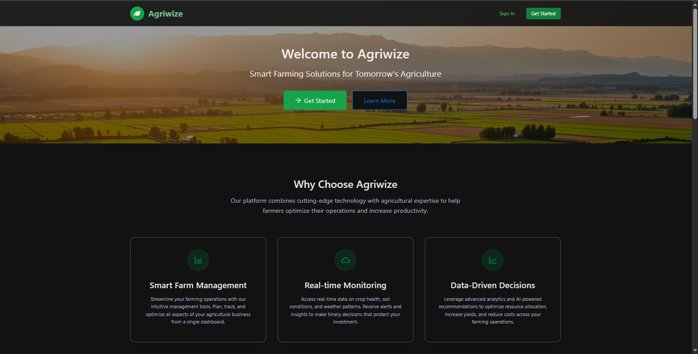
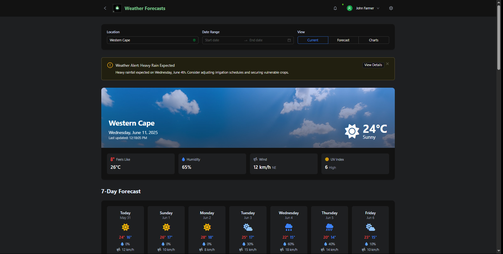
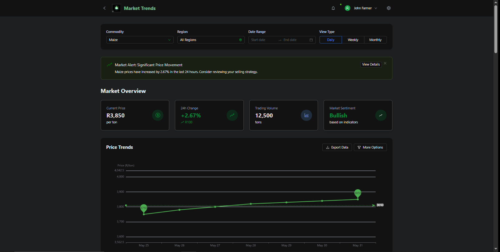
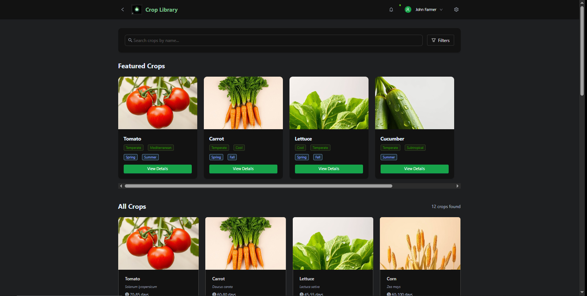
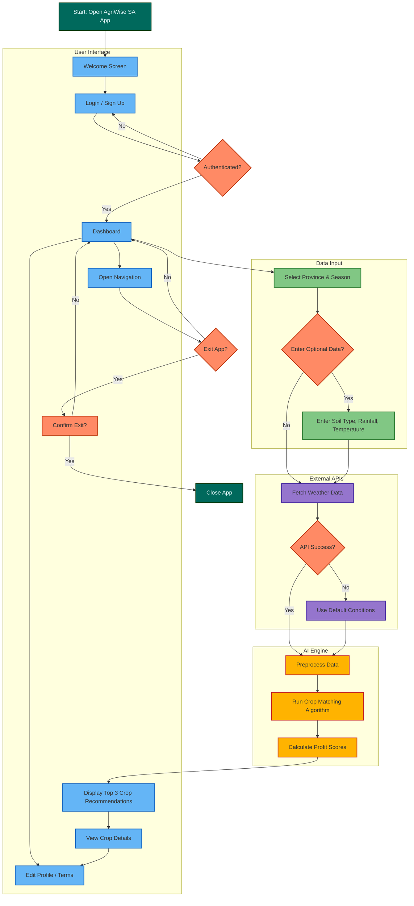

# AgriWise SA: Smart Agriculture Companion

## Project Summary

**AgriWise SA** is an AI-powered smart agriculture assistant designed specifically for South African farmers. It leverages predictive analytics to provide real-time weather forecasts, AI-based crop recommendations, profitability insights, and market trend analysis. This intelligent agent empowers farmers to make informed, data-driven decisions about which crops to plant and when, improving yield and financial outcomes.

## Project Goals

- Deliver seasonal crop recommendations using region-specific data
- Provide real-time weather insights to guide farming schedules
- Analyze market trends to highlight profitable opportunities
- Make farming more accessible through an intuitive, no-code prototype

## Installation Instructions

### 🔗 Prerequisites

- Web browser (Chrome, Firefox, Safari)
- Glide account (for cloning/editing the app)
- Internet access

### Setup Steps

1. **View the prototype in Creatie:**

   - Visit [Creatie](https://creatie.ai/file/161857066902119?fileOpenFrom=home&fileTileSwitch=false&page_id=25%3A7226&layer_id=25%3A75416)
   - Search or import the AgriWise SA prototype link

2. **Connect Data Sources:**

   - Use Google Sheets or Glide Tables with crop data, weather sources, and market values

3. **Configure API Integrations (Optional):**

   ```
   Weather API Key = YOUR_API_KEY
   Market API Endpoint = https://api.marketdata.za/v1/
   ```

4. **Publish & Test:**

   - Customize branding, add team members
   - Publish to web/mobile

## Usage Examples

### Quick Start

1. Open the AgriWise App
2. Log in using your email
3. Choose your province and season
4. Receive crop recommendations instantly

### Detailed Workflow

1. Select “Weather Forecast” to view your region’s 7-day outlook
2. Tap “Market Trends” to compare crop prices by region
3. Navigate to “Crop Library” to explore optimal planting times
4. Use the planting guide and expert tips for smarter planning

## Visual Aids

### Screenshots

- Welcome/Login Screen

- Weather Dashboard

- Market Analytics

- Crop Detail View


### Video Demo

- Display as to how the Prototype works:
[](Resources/Pictures/DisplayOfPrototype.mp4)


### Flow Diagram


## Table of Contents

- [Project Summary](#project-summary)
- [Project Goals](#project-goals)
- [Installation Instructions](#installation-instructions)
- [Usage Examples](#usage-examples)
- [Visual Aids](#visual-aids)
- [Technical Overview](#technical-overview)
- [User Interaction](#user-interaction)
- [Landing Page](#landing-page)

## Technical Overview

### Core AI Flow

1. **User Input**: Province, Season, Soil Data, Rainfall
2. **Preprocessing**: Cleans data and assigns scores
3. **AI Prediction**: Matches input to crops and calculates profitability scores
4. **Output**: Displays top 3 crops with detailed profiles

### 🔧 Data & API Dependencies

| Component        | Function                                           |
| ---------------- | -------------------------------------------------- |
| Weather API      | Real-time weather metrics                          |
| Crop Dataset     | Historical yield, demand, seasonal info            |
| AI Crop Model    | Matches user input to top-performing crops         |
| Output Interface | Renders charts, tables, actionable recommendations |
| Fallback Logic   | Uses static dataset when APIs fail                 |

## User Interaction

- **Input**: Province, season, and farming conditions
- **View**: Real-time weather, expert crop advice, and market trends
- **Navigation**: Simple tab bar + logout/exit confirmation
- **Crop Details**: Tap entries for in-depth planting and care tips

## Landing Page

You can view and explore AgriWise SA via its public landing page:

- **Video Demo**: Available Above — link above
- **Creatie Prototype**: View and duplicate directly via [Creatie](https://www.glideapps.com/)

## Notes

- Built using **Readdy.ai** (no-code platform)
- Easily adaptable to include more provinces, crops, or user profiles
- Ideal for agricultural support programs, extension workers, and farming cooperatives
- Demonstrates use of an **AI Agent** for **predictive analysis** in agriculture

